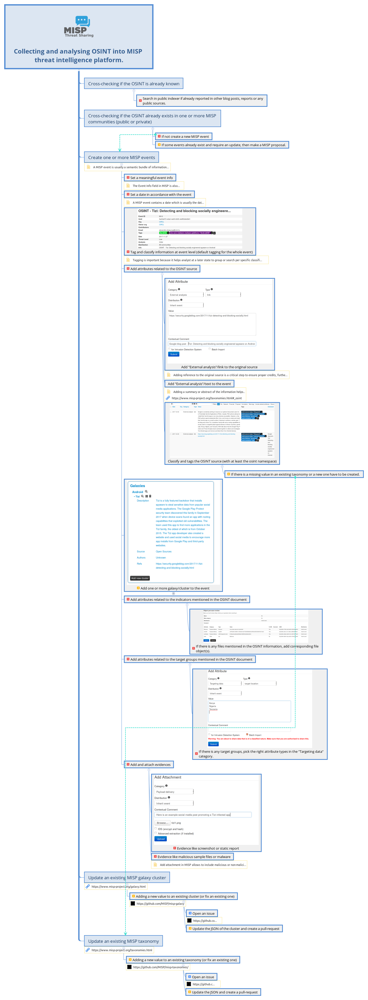

# misp-osint-collection

Collection of best practices to add OSINT into MISP and/or MISP communities

The document is available in XMind format and the [source is available](docs/Collecting_and_analysing_OSINT_into_MISP_threat_intelligence_platform.xmind).

# How to contribute?

Fork the project, download the XMind format document, edit the document with XMind, commit and do a pull-request.

